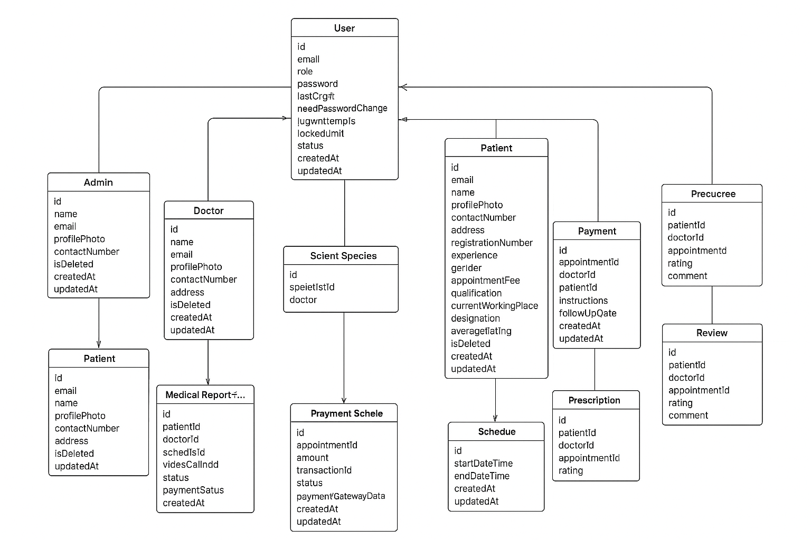

# 📦 PH HealthCare Server

Welcome to the **backend repository** for **PH HealthCare**, a full-featured healthcare management system connecting **Admins, Doctors, and Patients**.

The backend handles:

- Server-side logic and business rules  
- Database management with PostgreSQL and Prisma  
- Role-based access control (RBAC) for Admin, Doctor, and Patient  
- Appointment scheduling, video calls, and prescription management  
- Payment processing and reporting  

---

## 📸 Database Design



---

## 🚀 Features

- **Role-Based Access Control (RBAC)** – Separate permissions for Admins, Doctors, and Patients.  
- **Doctor Scheduling & Appointments** – Manage availability, book appointments, and track status.  
- **Video Consultations** – Secure online video call integration.  
- **Digital Prescriptions** – Doctors can issue and manage prescriptions online.  
- **Payment Handling** – Track and update payment status for appointments.  
- **Patient Health Data & Reports** – Manage medical history, health records, and reports.  
- **Reviews & Ratings** – Patients can rate doctors after appointments.  

---

## 🛠 Tech Stack

- **Backend:** Node.js + Express.js  
- **Database:** PostgreSQL with Prisma ORM  
- **Authentication & Authorization:** JWT, Role-based Access Control  
- **Validation:** Zod  
- **Media Storage:** Cloudinary  

---

## 📦 Installation & Setup

### 1. Clone the Repository

```bash
git clone https://github.com/abdullahal5/healthcare-server.git
cd healthcare-server
npm install
# or
yarn install
```

---

## 🔑 Environment Variables

Create a `.env` file in the root of the project and add the following variables (use your own secure values instead of these demo placeholders):

```env
NODE_ENV="development"
PORT=3000
DATABASE_URL=
JWT_SECRET="ksfljkdsjflksdjflk"
EXPIRES_IN="30d"
REFRESH_TOKEN_SECRET="skdslfjiskfjsdf"
REFRESH_TOKEN_EXPIRES_IN="30d"
RESET_PASS_TOKEN="1244444444kkkkk"
RESET_PASS_TOKEN_EXPIRES_IN="5m"
RESET_PASS_LINK="FRONT-END RESET PASS LINK"
EMAIL="YOUR EMAIL"
APP_PASS="APP PASS"
```
